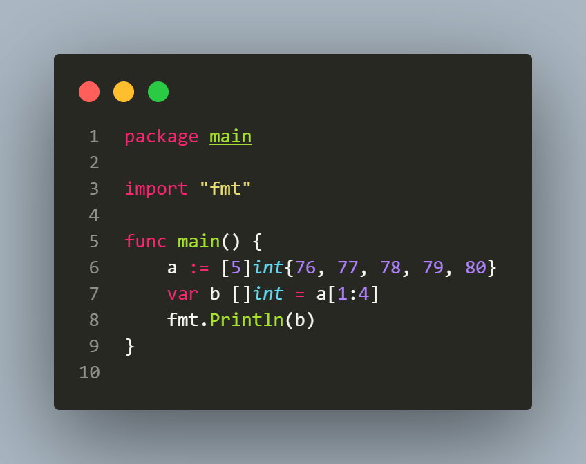
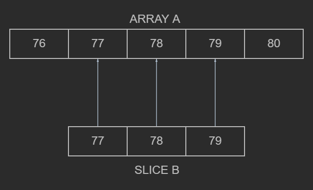

## L2.1

This Go snippet demonstrates how slicing an array creates a slice that references the same underlying storage. 

The array a is initialized with [76, 77, 78, 79, 80], and the expression a[1:4] produces a slice b containing [77, 78, 79]. Instead of copying values, the slice header stores a pointer to a[1], a length of 3, and a capacity of 4.

