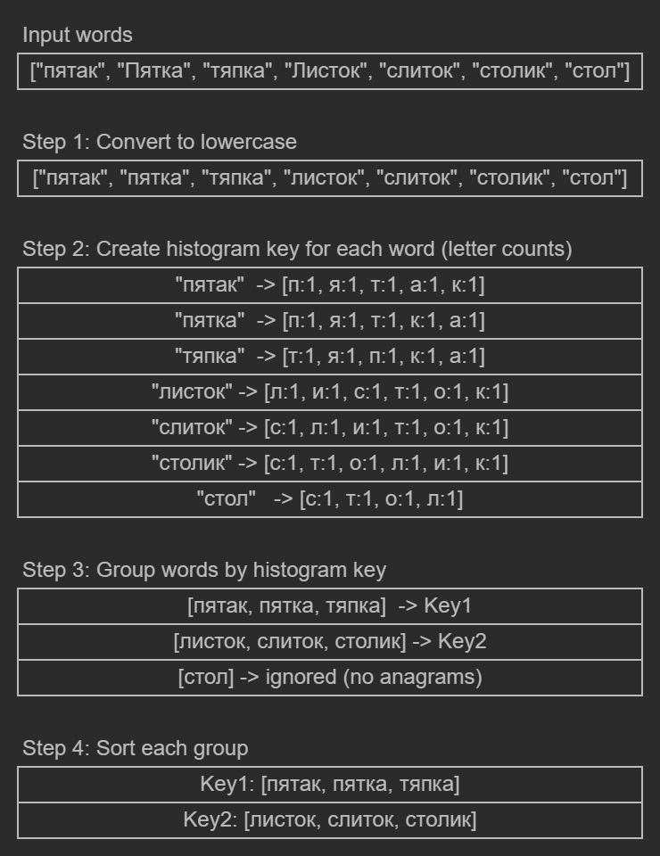

## L2.11

This Go snippet demonstrates a function that groups Russian words into sets of anagrams. Each anagram group is represented as a map entry, where the key is the first word encountered in lowercase, and the value is a slice of all words belonging to the group, sorted in ascending order. Words without any anagrams are ignored.

The program converts each word to lowercase and creates a histogram of letter counts using a fixed-size array of 33 elements, corresponding to the Russian alphabet ('а'–'я'). This array acts as a signature for the anagram group. Words with the same signature are collected together. Finally, each group with more than one word is sorted and added to the result map.

The approach is inspired by a solution I found for [LeetCode Problem 49. Group Anagrams](https://leetcode.com/problems/group-anagrams/). Since the task specifies that input contains only Russian words, a fixed-size array is used to build a letter histogram instead of sorting the letters in each word. Creating a histogram has linear complexity with respect to the word length, making it faster than sorting and allowing the solution to group anagrams efficiently in O(n * m) time, where n is the number of words and m is the average word length.

