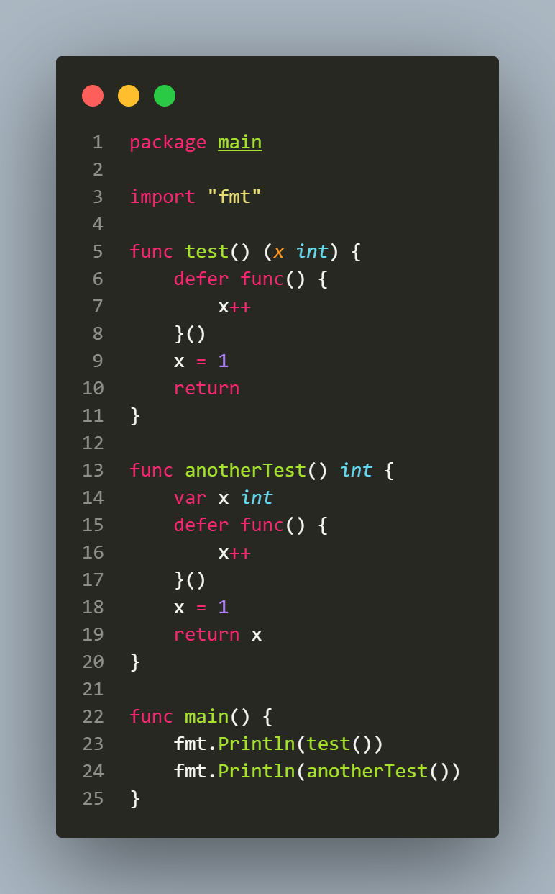

## L2.2

This Go snippet demonstrates how deferred functions interact with named and unnamed return values.

The function test uses a named result variable x, so when return is executed, x is still in scope and the deferred closure modifies it from 1 to 2, making the final return value 2. In contrast, anotherTest returns an unnamed result: the value of x is copied into a temporary return slot before deferred calls run, so when the closure increments the local x to 2, it does not affect the already stored return value, and the function returns 1.
