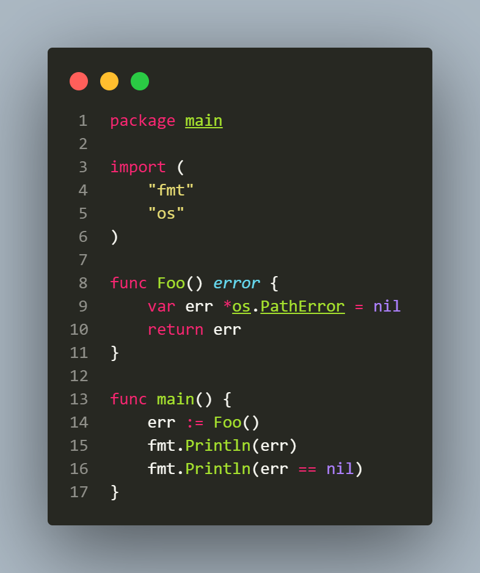

## L2.3

This Go snippet demonstrates how interfaces work internally in Go and highlights the subtle difference between a typed nil and a nil interface. 




In Go, an interface is internally represented as a pair of pointers: one pointing to the type information and another pointing to the value:

```go
type iface struct {
	tab  *itab
	data unsafe.Pointer
}
```

By contrast, an empty interface has no method set, so the runtime doesn’t need an itab. Its representation is slightly simpler:

```go
type eface struct {
    _type *_type
    data  unsafe.Pointer
}
```

The key difference is that iface stores type info tied to a method set, while eface just stores the concrete type. For interface{} both fields can be nil, so the interface is truly nil. For a non-empty interface, a typed nil still carries type info, so the interface isn’t nil.

In the Foo function the variable err is a typed pointer (*os.PathError) that is set to nil. When err is returned as an error interface, Go wraps it into the interface, storing both the type (*os.PathError) and the value (nil). 

```go
func Foo() error {
    var err *os.PathError = nil
    return err
}
```

The interface now contains a type, so the interface itself is not nil, even though the underlying pointer it holds is nil. This explains why returning a typed nil from a function that returns an interface can produce unexpected results:

```
go run main.go 
<nil>
false
```
