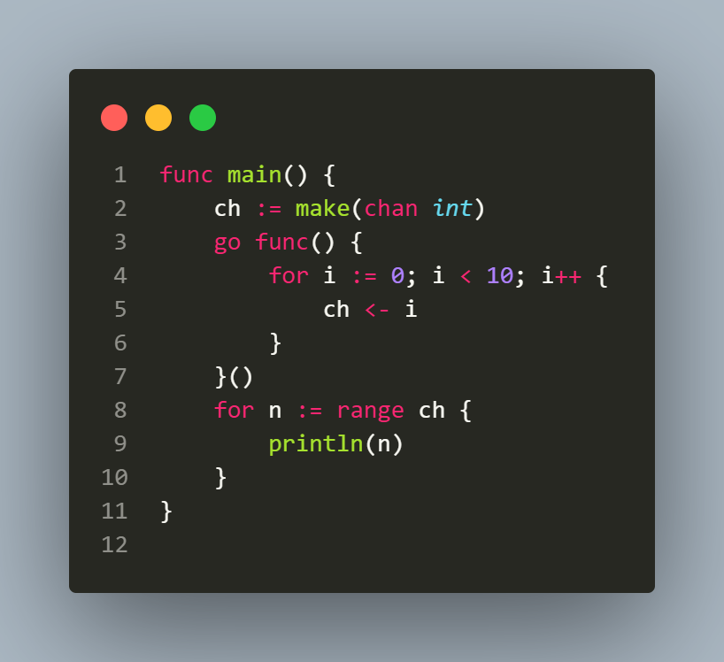

## L2.4

This Go snippet illustrates a standard producer-consumer pattern with channels and goroutines, highlighting a common cause of deadlocks.

The program creates an unbuffered channel ch for integers and launches a goroutine that iterates from 0 to 9, sending each value into the channel. The main goroutine attempts to read all values and print them.

The deadlock occurs because the range loop on a channel continues until the channel is closed, but in this code the sending goroutine never calls close(ch). After sending the 10 values, the sender terminates, leaving the main goroutine blocked, waiting for more values that will never arrive.
