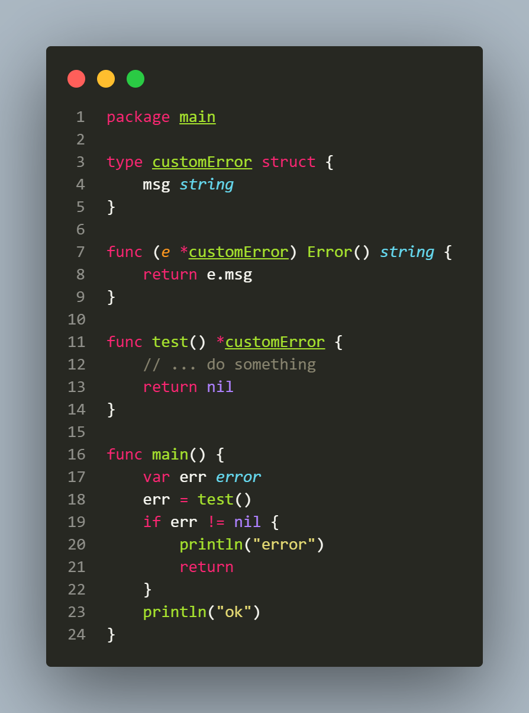

## L2.5

This snippet revisits how interfaces work internally in Go, building on the concepts introduced in L2.3, and emphasizes the subtle distinction between a typed nil and a nil interface.

In Go, a non-empty interface like error stores both type information and a value pointer. Even if the value is nil, the interface itself is non-nil.

The key takeaway of L2.3 and L2.5 is that a typed nil in a non-empty interface is not equal to a nil interface, since the type information is retained.
