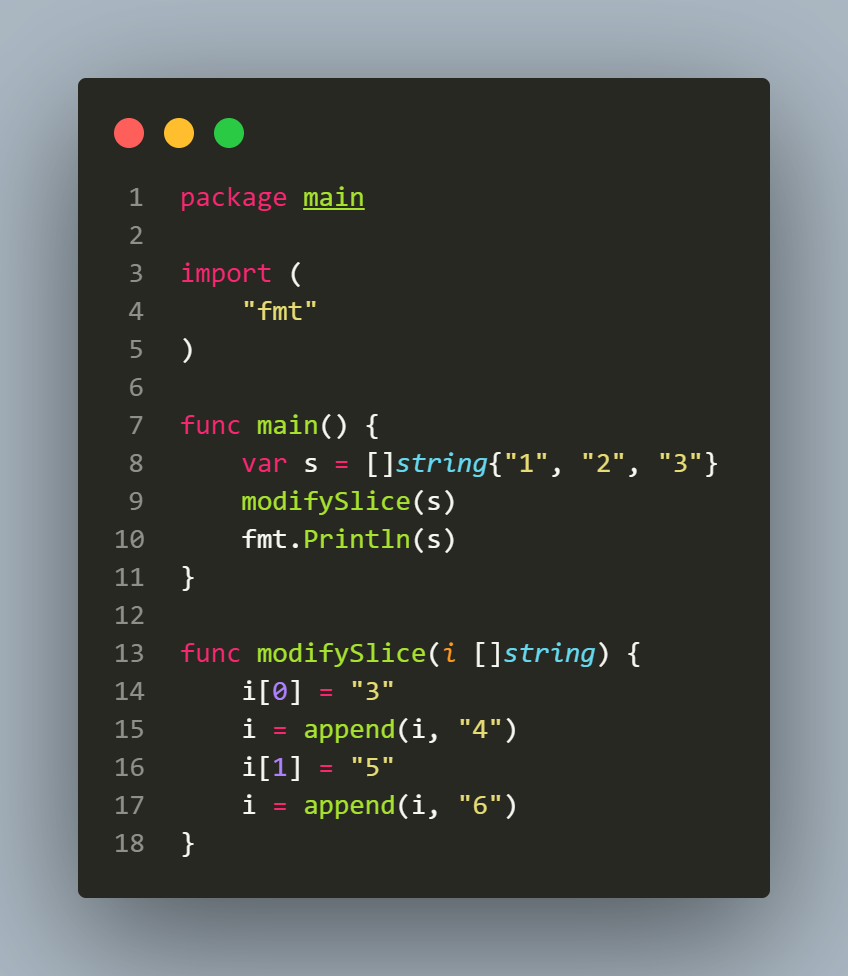

## L2.6

This Go snippet demonstrates how slices are passed to functions and how modifications affect the underlying array.

The program creates a slice s with three strings and passes it to modifySlice. Assignments to individual elements directly modify the underlying array, so these changes are visible in the caller.

However, operations like append that may increase the slice beyond its current capacity can allocate a new underlying array. Reassigning the slice within the function then only changes the local copy of the slice and does not affect the original slice in main. Subsequent modifications to elements after such an append only affect the new array, leaving the caller’s slice unchanged.
