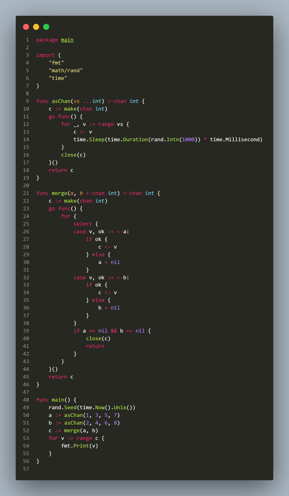

## L2.7

This Go snippet demonstrates a typical fan-in pattern, where multiple channels are merged into a single output channel, highlighting the use of select to handle multiple inputs and the pattern of setting channels to nil when they are closed.

The program creates two channels a and b that emit integers at random intervals. The merge function reads from both channels using a select inside a loop. When a value is received, it is sent to the output channel c. If a channel is closed, it is set to nil so that select no longer tries to read from it. Once both input channels are closed, c is closed and the goroutine exits.
