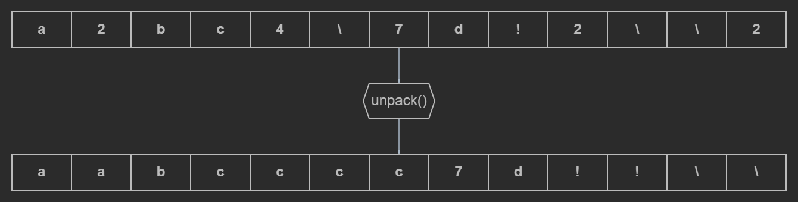

## L2.9

This Go snippet demonstrates a function that unpacks strings encoded with a simple run-length encoding (RLE) format. It supports repetition counts after characters, as well as escaping with backslashes to handle digits and the backslash character itself.

The program iterates over runes in the input string and reconstructs the expanded form into a strings.Builder. Regular characters may be followed by a number that specifies how many times they should be repeated. A backslash introduces escape rules:

\digit — inserts the digit literally, optionally with a repeat count

\char — inserts the character literally

\\ — inserts a backslash, optionally repeated with a count

The helper function toInt reads consecutive digits from the rune slice starting at a given position and converts them to an integer, returning 1 if no digits are found (default repeat count).

If the input is empty, an empty string is returned. If the entire input is numeric, the function returns an error since no characters are available to unpack. All error cases are reported with descriptive messages, e.g., invalid repeat count parsing.

The utility can be run using **make**, which executes the program. Unit tests can be launched with **make test**, and the code can be checked with **make lint**, which runs golangci-lint to detect style issues and potential problems.
